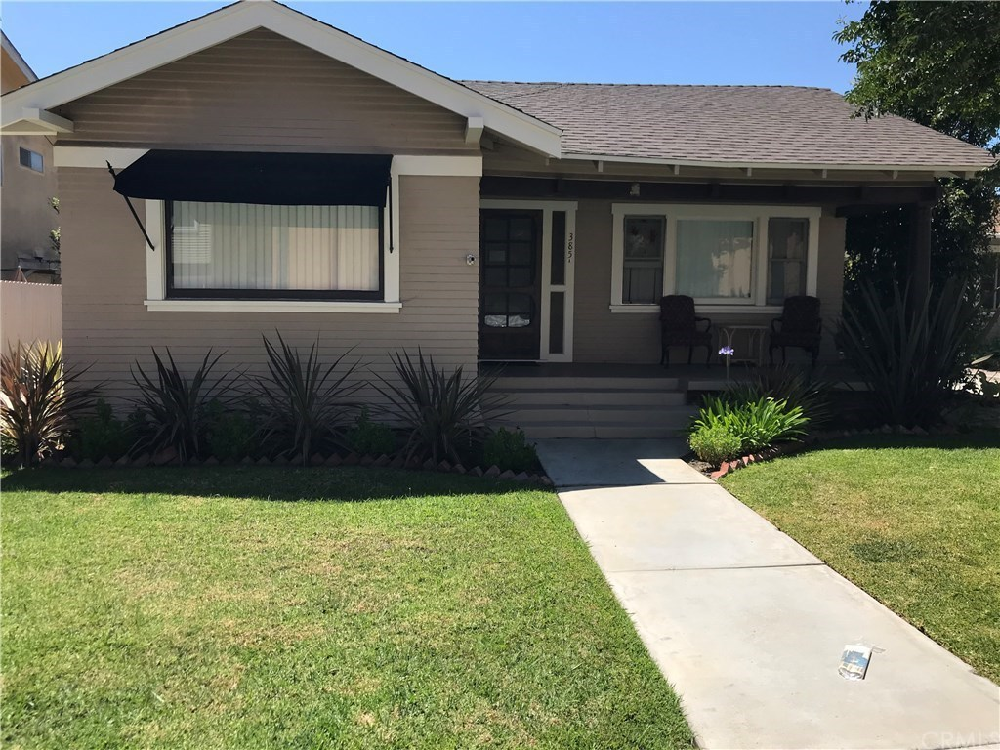
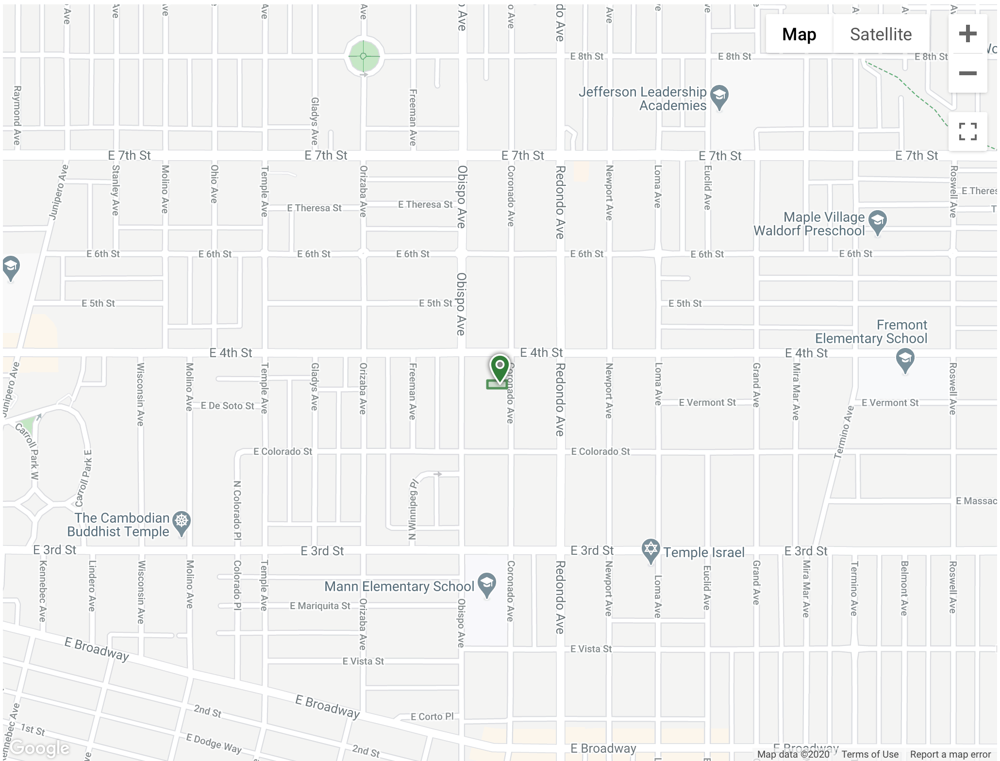
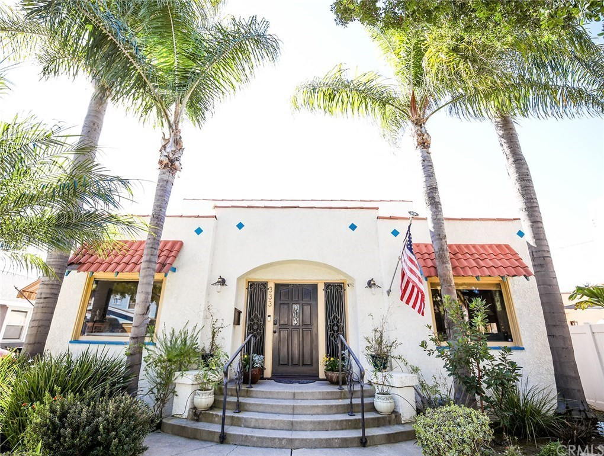
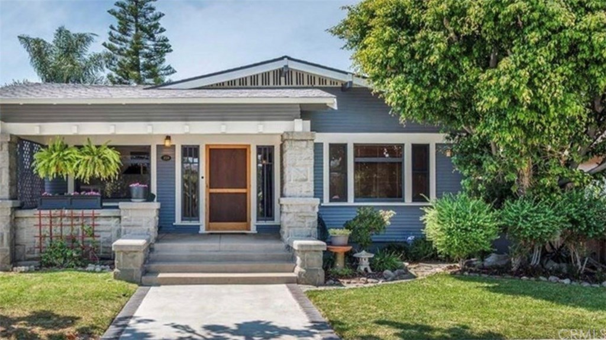
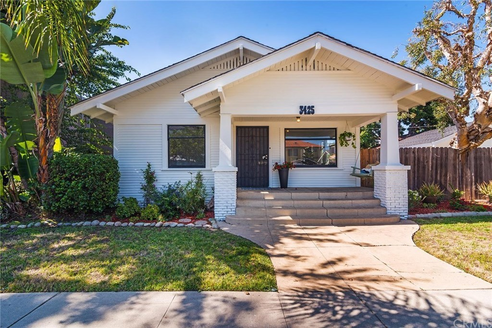
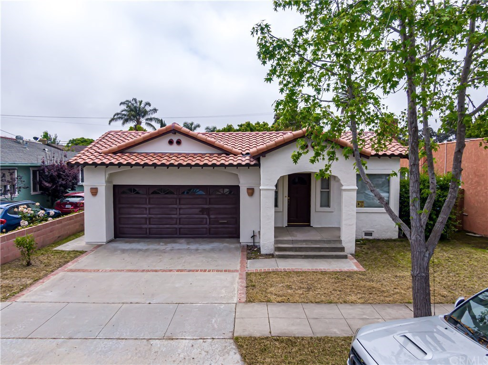
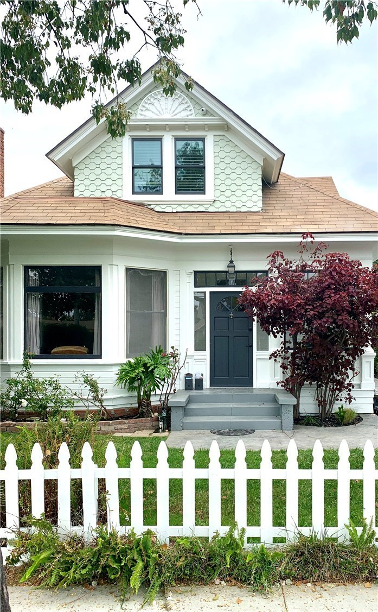
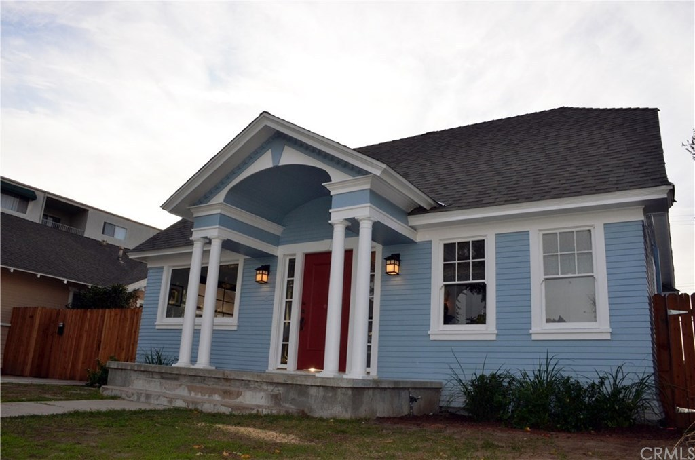

# Competitive Market Analysis (CMA) #
 
 

| **385 Coronado Ave   Long Beach, CA 90814**   (Belmont Heights / Alamitos Heights) |
| :-: |
|  |

- List Price: $1,078,800
- Redfin Estimate: $1,203,613
- Liveable space: 2,217 Sq Ft ($487/Sq Ft)
- Lot Size: 6,751 Sq Ft
- Duplex, 5 Beds & 3 Baths
- Year Built: 1921
- Time on Redfin: 74 days
- MLS# OC20148812
|

|  |
| :-: |

## Recently Sold Nearby ##
 
 

| **331 Termino Ave   Long Beach, CA 90814** |
| :-: |

|  | Sold: June 25, 2020   Sold Price: $1,120,000   Redfin Estimate: $1,291,551   Liveable Space: 1,998 Sq Ft ($561/Sq Ft)   Lot Size: 5,155 Sq Ft + Duplex, 5 Beds, 3 Baths   Year Built: 1921   MLS# PW20050472 |
| :-: | - |

|  |
| :-: |
| **359 Orizaba Ave   Long Beach, CA 90814** |

Details:

- Sold: February 27, 2020
- Sold Price: $1,271,000
- Redfin Estimate: $1,309,181
- Livable Space: 2,126 Sq Ft ($616/Sq Ft)
- Lot Size: 6,501 Sq Ft
- Duplex, 5 Beds, 4 Baths
- Year Built: 1961
- MLS# PW19266840

|  |
| :-: |
| **3425 E 3rd St   Long Beach, CA 90814** |

Details:

- Sold: September 4, 2020
- Sold Price: $1,100,000
- Redfin Estimate: $1,196,398
- Livable Space: 2,030 Sq Ft ($542 Sq Ft)
- Lot Size: 7,426 Sq Ft
- Duplex, 4 Beds, 2 Baths
- Year Built: 1918
- MLS# PW20115880

|  |
| :-: |
| **3906 E 6th St   Long Beach, CA 90814** |

Details:

- Sold: July 22, 2020
- Sold Price: $940,000
- Redfin Estimate: $1,155,265
- Livable Space: 2,198 Sq Ft ($428/Sq Ft)
- Lot Size: 6,308 Sq Ft 
- Single Family Home, 4 Beds, 2 Baths
- Year Built: 1927
- MLS# IV20094765

|  |
| :-: |
| **3025 E Corto Pl   Long Beach, CA 90803** |

Details:

- Sold: July 21, 2020
- Sold Price: $1,365,000
- Redfin Estimate: $1,554,119
- Livable Space: 3,000 Sq Ft ($455/Sq Ft)
- Lot Size: 7,501 Sq Ft
- Triplex, 4 Beds, 5 Baths
- Year Built: 1903
- MLS# PW20108427

|  |
| :-: |
| **367 Coronado Ave   Long Beach, CA 90814** |

Details:

- Sold: February 20, 2020
- Sold Price: $1,260,000
- Redfin Estimate: $1,293,400
- Livable Space: 2,654 Sq Ft ($487/Sq Ft)
- Lot Size: 6,751 Sq Ft
- Duplex, 4 Beds, 3 Baths
- Year Built: 1923
- MLS# PW19280150
